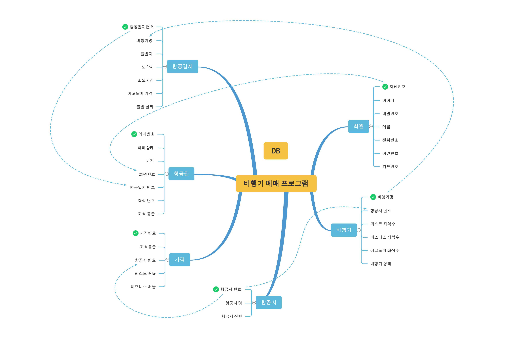
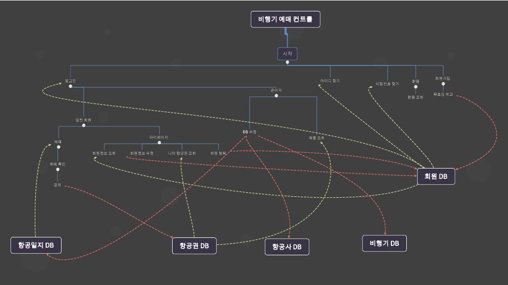

# 항공권 예매 프로그램
* * *
### 개요
<h6>사용자는 로그인 후 출발일과 목적지를 선택하고 출력된 비행기를 지정 후 좌석등급, 좌석번호를 선택하여 결제 후 항공권을 발급해주는 프로그램</h6>

***

### 목적
<h6>앞으로 급증할 해외여행 수요를 감안하여 편리하게 항공권 예매를 도와줄 프로그램을 JAVAFX로 구현</h6>

* * *
### 개발 일정

| 일차 | 현황 | 내용 |
| ------ | --------- | ----------------------- |
| 1일차 | :ballot_box_with_check: | Topic Selection |
| 2일차 | :ballot_box_with_check: | Database Design |
| 3일차 | :ballot_box_with_check: | Controller, Readme, Class Structure, Front Prototype |
| 4일차 |  | 회원가입 / 로그인 / 아이디 & 비밀번호 찾기 |
| 5일차 |  | DB생성 / 예매 control|
| 6일차 |  | 예매 control |
| 7일차 |  | 예매 control |
| 8일차 |  | 환율 차트 control |
| 9일차 |  | 관리자 / 회원 개인 페이지 |
| 10일차|  | 점검 / 보완 | 

***

### 역할

- [ ] __김용준 [Github](https://github.com/godoklife/JAVA_study)__
> DB 생성, 마이페이지 

- [ ] __정희승 [Github](https://github.com/Heeahn/Ezen_Web_A)__
> 회원가입, 아이디 & 비밀번호 찾기

- [ ] __김지웅 [Github](https://github.com/KimJiUng/java2)__
>로그인, 관리자 페이지

- [ ] __장승빈 [Github](https://github.com/JSB95/Academy)__
>예매, 환율조회 페이지

***

### 개발 우선순위
+ **1순위**
  - 회원가입
  - 로그인
  - 예매
  - DB 생성
+ **2순위**
  - 환율
  - 관리자 페이지
  - 마이 페이지
  - 아디찾기 & 비밀번호 찾기

***

### DB 설계

***

### 컨트롤 구조도

***

### VIEW[FXML] 프로토타입

***
